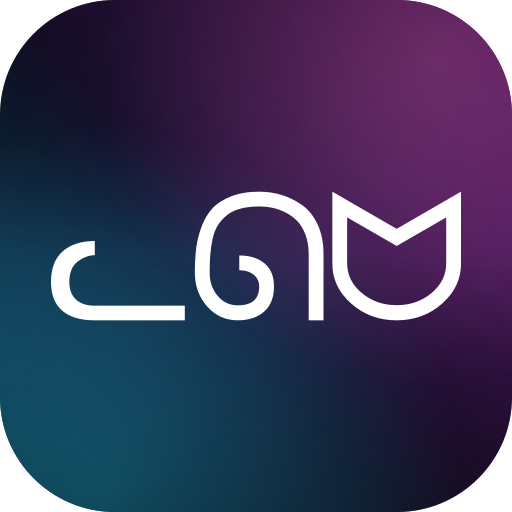
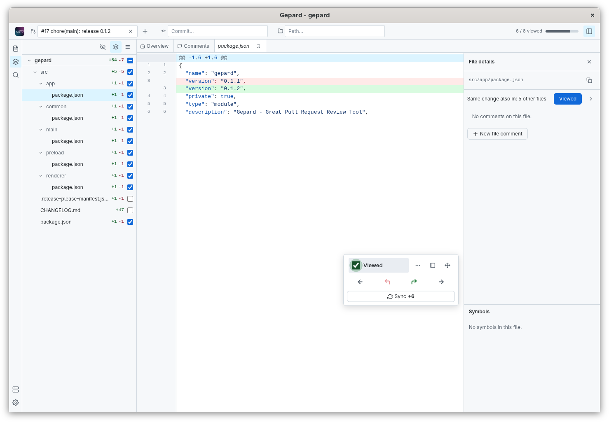

  

# Gepard - Great Pull Request Review Tool

Gepard is a desktop app for reviewing large GitHub pull requests. Instead of
a limited GitHub web diff it works in a real clone of the repository, so a review
is reading the code as it is, with everything around the changed lines available
for quick navigation and full context, with LSP support.

## What it changes about reviewing

- The whole repository is there, not only the diff. Text and regex search
  cover every file, and language servers provide symbol search, definitions,
  references and a per-file outline, so a change can be followed to the code
  it affects.
- Review scope is a target: a pull request, a single commit within it, or a
  path such as a folder or a glob. Navigation, search and viewed state follow
  that scope.
- Files are reviewed one at a time from the keyboard, marked viewed as you
  go, with files worth keeping open pinned alongside.
- Comments are drafted locally and can reference the definitions or other
  occurrences the comment is about. One Sync pushes them to GitHub as a
  single review, publishes the viewed marks and pulls the remote threads.
  Switching to a PR also refreshes its remote state; nothing is pushed until
  you sync.

  

## Usage

Download the build for your platform from the
[Releases](https://github.com/dee-gmiterko/gepard/releases) page: a Windows
installer, a macOS dmg or a Linux AppImage. Sign in with `gh auth login`,
start Gepard, add a project from its GitHub URL and pick a pull request to
review better.

## Extensions

Language support, syntax highlighting, themes and UI languages are
extensions. Text search and review work for any file type. These are
bundled; more are installed from Settings without a restart.

- Language servers
  - [TypeScript and JavaScript](extensions/lsp/typescript)
  - [Python](extensions/lsp/python/README.md)
  - [Java](extensions/lsp/java/README.md)
  - [C#](extensions/lsp/csharp/README.md)
  - [C/C++](extensions/lsp/cpp/README.md)
  - [PHP](extensions/lsp/php/README.md)
  - [GDScript](extensions/lsp/gdscript/README.md)
- Grammars
  - [Godot](extensions/grammars/godot/README.md)
- Themes
  - [Light](extensions/themes/light)
  - [Dark](extensions/themes/dark)
- Locales
  - [English](extensions/locales/en)

## Requirements

- The [GitHub CLI](https://cli.github.com/), signed in with `gh auth login`.
  Gepard talks to GitHub only through it and uses it as git's credential
  helper.
- [Git](https://git-scm.com/) on your `PATH`. Each project is a full clone
  kept in Gepard's own data directory.

## More

- [CONTRIBUTING.md](CONTRIBUTING.md): building, development and writing
  extensions.
- [docs/gepard.md](docs/gepard.md): the full product spec.
- [MIT license](LICENSE).

ᓚᘏᗢ